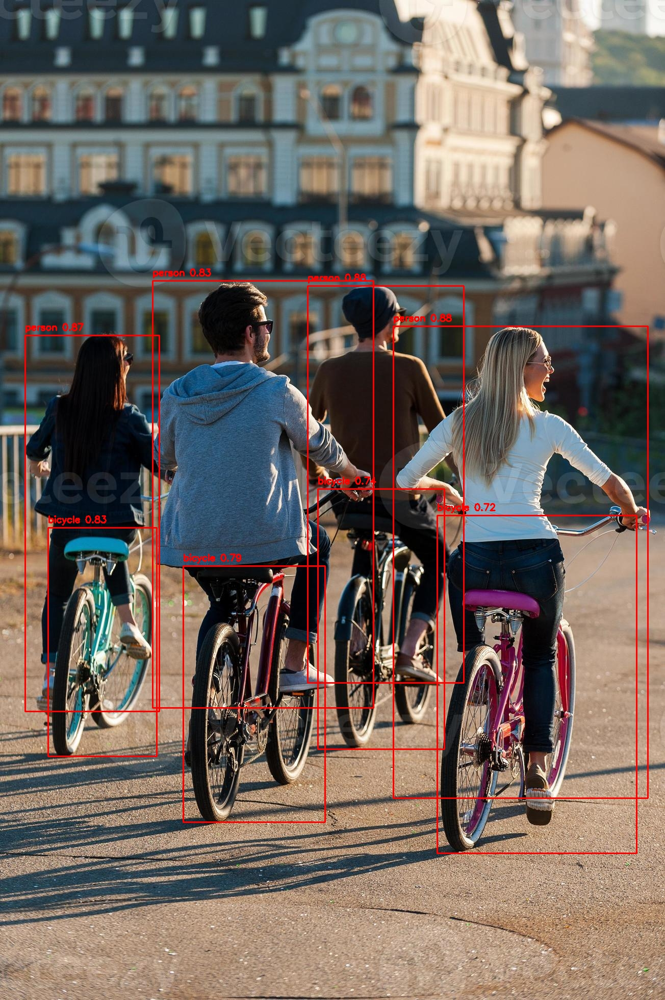
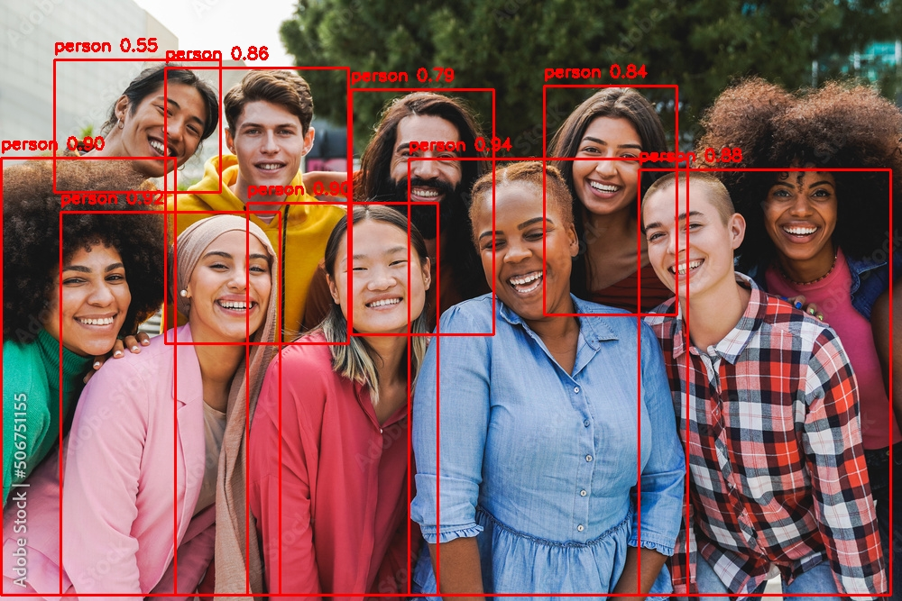

# **🔍 Real-Time Object Detection with YOLOv5**

Because detecting objects should be smart, fast, and just a little bit fabulous 💖. This is a fully offline, local object detection app built with:

🖼️ Image upload support

🎥 Real-time webcam detection

📄 Clean JSON download of detected objects

🎨 Custom designed pink-themed UI with Poppins font

Sleek, stylish, and seriously powerful — all rolled into one.

---

## **🚀 Quick Start**

1. Clone YOLOv5 repo (v6.2):

git clone --branch v6.2 https://github.com/ultralytics/yolov5.git

2. Download pretrained model (YOLOv5m.pt):

👉 Download yolov5m.pt

3. Install dependencies:

pip install -r requirements.txt

4. Launch your app:

streamlit run app.py

Boom. Your personal object detector is live. 🎯

---

## **🛠️ Tech Stack**

Python 3.10

Streamlit 1.25

YOLOv5m (v6.2 release)

Torch 2.0.1

Custom styles.css for UI magic

---

## **✨ Features**

Upload images for quick detection

Webcam live detection with one click

Stylish modern UI (Poppins font + pink theme)

Download JSON of detected objects

Fully offline — no internet needed once setup is done

---

## **📂 Project Structure**

yolov5-local-stable/
├── app.py

├── styles.css

├── yolov5/

├── yolov5m.pt

├── requirements.txt

└── README.md

---

## **📸 Screenshots:**

---

## **🙋‍♀️ Made By**

### **Harpreet Kaur 💜**

🔗 LinkedIn - www.linkedin.com/in/harpreet-kaur005

📫 Email - harpreetgill325@gmail.com

Finding objects in the world — and making it look good too.

---

## **📄 License**
MIT License — use it, remix it, build something even better.

---

# **🎀 Let's Detect, Predict, and Slay!**

